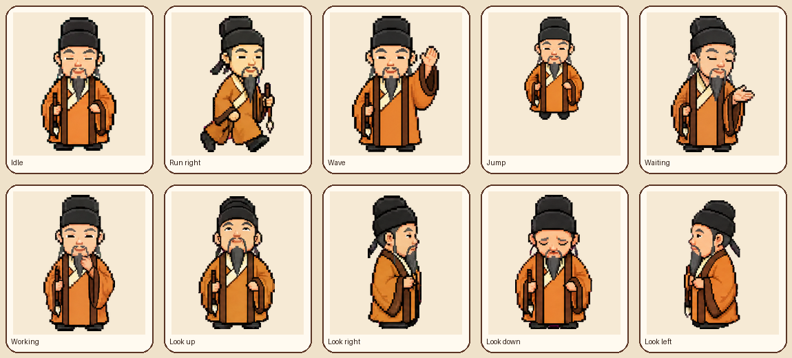

# SuShi

[简体中文](README.zh-CN.md)

SuShi is a warm pixel-art desktop pet inspired by the Chinese scholar Su Shi.
It is a Codex-compatible sprite v2 pet with nine standard animations and
sixteen clockwise look directions.

Install `pet.json` and `spritesheet.webp` together in a pet directory supported
by your Codex pet renderer. The atlas is 1536x2288 pixels with 192x208 cells.
No production project, provider credential, or Python environment is required.

The visual assets and preview are licensed under CC BY-NC 4.0. See
`LICENSE-ASSETS` for attribution and terms.

